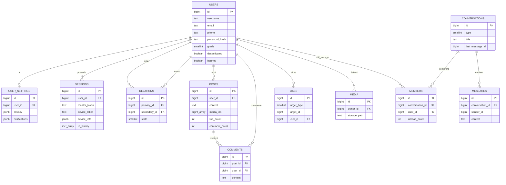

# ☁️ Nubo Backend - Architecture Core & Technical Documentation

> **Périmètre du document** : Ce document détaille l'architecture backend, les algorithmes mathématiques et l'infrastructure de données du réseau social Nubo. Conçu en Go, ce système hybride et hautement asynchrone est taillé pour des performances extrêmes et une scalabilité massive.

---

## 📋 Table des Matières

1.  **[🚀 Introduction et Philosophie Architecturale](#1--introduction-et-philosophie-architecturale)**
    *   1.1. Présentation du projet Nubo
    *   1.2. Paradigme "Write-Behind" & "Edge Computing"
    *   1.3. L'Écosystème à 3 Niveaux (L1 / L2 / L3)
2.  **[🗄️ Le Moteur de Données : Stratégies et Organisation des Caches](#)** *(À venir)*
3.  **[🧠 Moteur de Recommandation et Profilage (TDD Mathématique)](#)** *(À venir)*
4.  **[🔐 Sécurité Cryptographique et Authentification](#)** *(À venir)*
5.  **[⚡ Réseau Temps Réel et Messagerie (WebSockets & Pub/Sub)](#)** *(À venir)*
6.  **[💾 Schéma Relationnel et Structuration (PostgreSQL)](#)** *(À venir)*
7.  **[🛠️ Stack Technique, Composants et Déploiement](#)** *(À venir)*

---

## 1. 🚀 Introduction et Philosophie Architecturale

L'architecture du backend Nubo a été pensée pour répondre à des exigences critiques de très faible latence, de haute disponibilité, et de préservation des ressources matérielles. Plutôt que d'adopter une architecture monolithique classique en requête-réponse directe vers une base SQL, le système agit comme un "cerveau" asynchrone qui délègue le calcul et absorbe les chocs de trafic.

### 1.1. Présentation du projet Nubo : Réseau social premium et performant

Nubo se positionne comme un réseau social naturiste premium. Ce positionnement implique une expérience utilisateur (UX) parfaite, sans aucun temps de chargement perceptible. Les défis techniques inhérents à un réseau social moderne sont majeurs :
*   **Volumétrie massive des interactions :** Les likes, commentaires, vues et partages génèrent un flux continu de données qui peut facilement saturer une base relationnelle standard.
*   **Flux en temps réel :** Messagerie instantanée, notifications et mises à jour de flux nécessitent une infrastructure réseau (TCP/WebSockets) optimisée.
*   **Personnalisation poussée :** Servir des flux de contenus ("Feeds") basés sur des affinités sémantiques et comportementales demande des calculs mathématiques lourds.

Pour relever ces défis, le backend (écrit en Go 1.22+) ne se comporte pas comme un simple CRUD, mais comme un routeur de flux de données ultra-rapide.

### 1.2. Paradigme "Write-Behind" & "Edge Computing"

Pour garantir des temps de réponse de l'ordre de la milliseconde, Nubo s'appuie sur deux concepts d'ingénierie fondamentaux :

#### A. Le calcul déporté (Edge Computing)
Le calcul du profil comportemental de l'utilisateur (ses préférences, ses habitudes de scroll, son affinité sociale) n'est **pas** réalisé par nos serveurs.
*   Le client (l'application mobile ou web) enregistre les signaux implicites (temps passé sur un post, vitesse de défilement) et explicites (likes, commentaires).
*   Il calcule localement une moyenne mobile exponentielle (EMA) pour mettre à jour un vecteur dense $\mathbf{u} \in \mathbb{R}^{224}$.
*   Ce vecteur est ensuite envoyé au serveur (endpoint `/v1/profile/sync`) de façon périodique.
*   **Bénéfice :** Le serveur Go est totalement libéré de ces calculs lourds. Il se contente de valider l'intégrité du vecteur (via HMAC) et d'exécuter de simples produits scalaires optimisés (SIMD) pour générer les recommandations.

#### B. La persistance asynchrone (Write-Behind)
Une base relationnelle comme PostgreSQL est excellente pour la cohérence (ACID), mais souffre sous un déluge d'écritures simultanées.
*   **L'absorption en RAM :** Lorsqu'un utilisateur effectue une action (ex: un Like), l'API met à jour le cache Redis instantanément et place un événement dans une file d'attente asynchrone (`REQUEST Cache`). Le client reçoit un statut HTTP `200 OK` en quelques millisecondes.
*   **Le traitement par les Workers :** Un pool de workers en arrière-plan dépile ces événements. Ils regroupent les opérations par lots massifs (Batching) et les trient par ordre topologique pour respecter les contraintes de clés étrangères (ex: d'abord insérer l'utilisateur, puis son post, puis ses likes).
*   **L'insertion bulk :** Les écritures en base se font via des commandes de copie de masse (`pq.CopyIn` sur PostgreSQL), réduisant considérablement la charge IOPS sur les disques.

### 1.3. L'Écosystème à 3 Niveaux (L1 / L2 / L3)

Pour concilier la vitesse exigée par le frontend et la pérennité requise pour les données utilisateurs, Nubo déploie une stratégie de rétention hybride en trois couches (Tiers).

#### Pourquoi cette architecture hybride ?
La RAM est extrêmement rapide mais coûteuse et limitée. Le disque SSD est capacitif mais lent. Plutôt que de tout stocker en cache ou de tout lire sur disque, le système navigue intelligemment entre les couches via un **Pipeline d'Hydratation**. Lorsqu'une donnée est demandée, le système interroge L1. S'il y a un *Cache Miss*, il descend en L2. Si L2 échoue, il consulte L3. À chaque remontée, la donnée "réchauffe" les caches supérieurs (Promotion).

#### 🥇 Niveau 1 (L1) : Redis - Vitesse pure et structures avancées en RAM
Redis n'est pas utilisé comme un simple magasin clé-valeur. C'est le cœur névralgique de l'application.
*   **Mécanisme d'éviction intelligent :** Redis est configuré avec la politique `volatile-lfu` (Least Frequently Used). Il fonctionne proche de 100% de sa capacité et évince mathématiquement les objets les moins consultés pour protéger les données "chaudes".
*   **Stockage Binaire :** Les objets (Posts, Users) sont sérialisés en `MsgPack` (format binaire ultra-compact) plutôt qu'en JSON pour maximiser l'économie de RAM.
*   **Structures Complexes :** Utilisation massive des `ZSET` (Sorted Sets) pour classer les tendances (MOST Cache) et trier les boîtes de réception (SPEED Cache), ainsi que des listes `FIFO` pour les fils d'actualité.
*   **Temps réel :** Exploitation du paradigme `Pub/Sub` volatil pour distribuer les messages WebSocket instantanément entre les nœuds du cluster.

#### 🥈 Niveau 2 (L2) : MongoDB - Filet de sécurité documentaire
MongoDB agit comme la couche de stockage intermédiaire ("Warm Storage").
*   **Rôle principal :** Absorber les "Cache Misses" de Redis sans perturber PostgreSQL.
*   **Dénormalisation :** Il stocke les documents complets (ex: un Post avec ses méta-données prêtes à l'emploi).
*   **Fallback rapide :** Si la RAM Redis est saturée et expulse un vieux post, la requête HTTP viendra piocher ce document dans MongoDB en quelques millisecondes, évitant ainsi des requêtes SQL complexes et coûteuses en L3.

#### 🥉 Niveau 3 (L3) : PostgreSQL - Source de vérité absolue (ACID)
PostgreSQL 16 est la fondation indéboulonnable du système.
*   **Intégrité :** Il garantit l'intégrité relationnelle via un schéma hautement normalisé divisé en espaces logiques (`auth`, `content`, `messaging`, `moderation`).
*   **Jobs Asynchrones :** C'est sur PostgreSQL que tournent les calculs de nuit (ex: recalcul des scores algorithmiques de "Time-Decay", canonicalisation des hashtags fautifs) qui ne nécessitent pas une latence instantanée.
*   **Sécurité ultime :** En cas de crash total des couches de cache (L1 et L2), le backend est capable d'utiliser Postgres comme ultime recours (Fallback absolu) pour auto-réparer et "réhydrater" tout le système de manière transparente.

---

## 2. 🗄️ Le Moteur de Données : Stratégies et Organisation des Caches (Redis & Mongo)

Le socle de performance de Nubo repose sur une architecture de cache hautement spécialisée. Redis n'y est pas un simple magasin clé-valeur de passage, mais un agrégat de structures de données sophistiquées divisées en sous-systèmes logiques.

### 2.1. OBJECT Cache (Le Stockage Principal LFU)

C'est le système de stockage de niveau 1 (L1) responsable de conserver les entités lourdes complètes (Users, Posts, Comments).

*   **Sérialisation binaire via MsgPack :** Plutôt que de stocker du JSON brut, les structures Go sont sérialisées en `MsgPack`. Ce format binaire est ultra-compact en RAM et extrêmement rapide à dé/sérialiser côté serveur.
*   **Politique `volatile-lfu` et TTL élastique :** Le cluster Redis tourne avec la politique d'éviction *Least Frequently Used*. Les objets sont insérés avec un *Time-To-Live* par défaut (ex: 7 jours). Si la mémoire sature, Redis évince mathématiquement les objets les moins consultés avant leur expiration. Le TTL devient donc "élastique" et s'adapte à la pression du trafic.
*   **Le Pipeline d'Hydratation :** Lorsqu'un flux de données est demandé (ex: 50 IDs de posts), le système applique un workflow de réconciliation automatique :
    1.  **Rafale L1 (Redis Multi-Get) :** L'API lance une seule commande `MGET` pour récupérer les 50 objets en un seul aller-retour réseau.
    2.  **Mongo Fallback (L2) :** Les IDs non trouvés dans le cache (Cache Miss) sont isolés et demandés à MongoDB via une requête optimisée (`$in`).
    3.  **Postgres Fallback (L3) :** Si des données manquent encore (ex: après un crash L2), une requête SQL est exécutée en ultime recours sur PostgreSQL.
    4.  **Promotion (Auto-guérison) :** Les données récupérées en L2 ou L3 sont immédiatement réinsérées dans Redis (Promotion L1) pour réparer le cache à la volée.

### 2.2. MOST Cache (Recherche, Trending & Tags)

Ce cache gère l'algorithmique de découverte. Il fournit des listes pré-triées de manière quasi instantanée.

*   **Utilisation des ZSET Redis :** Le classement repose sur les *Sorted Sets* de Redis. La clé représente le canal (ex: un hashtag), le membre est l'ID Snowflake du post, et le score détermine son classement.
*   **Mode Strict vs Mode Global :**
    *   *Mode Strict :* Les ZSETs comme `rank:likes:strict` classent les contenus par leur métrique pure et absolue (le score = le nombre total exact de likes).
    *   *Mode Global :* Les ZSETs comme `rank:global` utilisent les scores algorithmiques de "Time-Decay" (chaleur temporelle) générés par le moteur de recommandation.
*   **Le Capping automatique (Guillotine mathématique) :** Pour empêcher les ZSETs de croître à l'infini, un script Lua garantit l'atomicité de l'insertion et du nettoyage : on ne garde que les 5000 meilleurs éléments. Tout score qui dépasse ce rang déclenche un `ZREMRANGEBYRANK key 0 -5001` (Guillotine).
*   **Le Seeding :** Au démarrage (Cold Start), l'API scanne PostgreSQL, calcule les scores de tous les posts existants et amorce les ZSETs Redis. Le cache est instantanément "chaud".

### 2.3. USER Cache (Le Profil Rapide)

Ce cache sert à afficher la grille de publications d'un utilisateur instantanément sans joindre la base relationnelle.

*   **Structure ZSET chronologique :** Les posts d'un utilisateur sont stockés dans un ZSET (ex: `user:posts:<user_id>`) où le score est le Timestamp de création (Unix Epoch), garantissant un tri chronologique parfait (du plus récent au plus ancien).
*   **La "Règle des 100" (Smart Fallback) :** Statistiquement, 95% des visiteurs ne dépassent jamais les 100 premières publications d'un profil. Ce ZSET est donc strictement plafonné à 100 IDs par utilisateur. Si un visiteur défile au-delà (offset > 100), le backend le détecte et contourne Redis pour effectuer une requête paginée sur MongoDB.

### 2.4. FEED Cache (Fil d'Actualité)

Gère la génération des "Timelines" des utilisateurs.

*   **Structure en liste FIFO :** Utilisation des clés `LIST` dans Redis (`feed:user:<user_id>`).
*   **Mécanique de Fan-out on Write :** Nubo utilise un modèle de "Push" asynchrone. Lorsqu'un utilisateur crée un post, l'API ne fige pas la réponse. Un travailleur de l'ombre (Worker) récupère la liste de ses abonnés et effectue un `LPUSH` massif de l'ID du post dans les feeds des abonnés actifs. La lecture du feed se résume ainsi à un simple `LRANGE` temporel ultrarapide (complexité O(1)).

### 2.5. REQUEST Cache (L'Entonnoir de Persistance Asynchrone)

Afin d'encaisser des pics d'écriture violents ("Write-Heavy") sans perturber l'expérience utilisateur et l'intégrité de PostgreSQL, Nubo implémente une file de messagerie avancée maison.

*   **Le Shard Unifié et le partitionnement (CRC32) :** Les écritures ne tapent pas directement la BDD. Elles sont envoyées sous forme de messages `AsyncEvent` vers l'une des 64 files Redis (ex: `q:14`). L'ID de l'entité (ou de son parent) est haché via CRC32 pour assigner un shard (`Partition Key`), ce qui garantit qu'un Like atterrira systématiquement dans le même shard et chronologiquement *après* le Post auquel il se rattache.
*   **Le Worker Intelligent :** 64 workers (Goroutines) dépilent les shards de façon bloquante (via `BLPOP`). Ils récupèrent des lots massifs (Batching), puis effectuent un **Tri Topologique** en RAM pour séparer et ordonner les entités selon la hiérarchie SQL (Users d'abord, puis Posts, puis Likes, etc.). Les données sont ensuite fusionnées en tables temporaires et poussées en une seule transaction via la commande `COPY` (`pq.CopyIn`), ce qui est la méthode d'insertion SQL la plus rapide existante.
*   **La Résilience (Dichotomie & DLQ) :** Si un lot de `COPY` échoue en raison d'une donnée corrompue (ex: violation d'intégrité), le worker effectue un *Rollback*, puis divise le lot de manière récursive (Dichotomie) pour isoler la requête empoisonnée. Cette ligne est envoyée en quarantaine dans la *Dead Letter Queue* (`dlq:postgres_errors`) sur Redis, pendant que le reste des données saines est validé avec succès.

### 2.6. SPEED Cache (Inbox & Métadonnées Instantanées)

Le SPEED Cache est un modèle hybride de pointe, conçu pour des réponses à latence "Zero" lors d'opérations UX critiques (messagerie, recherche IRL).

*   **Dénormalisation extrême :** Les données publiques et récurrentes sont aplaties dans des modèles ultra-légers (`UserLite`, `ConvLite`, `MemberLite`). On y stocke uniquement l'essentiel : ID, Pseudos, compteurs non lus, Rôles.
*   **Index lexicographique à score zéro :** Pour l'auto-complétion (barre de recherche), les pseudos sont indexés via `ZADD` avec un score absolu de `0` (clé `users:search:lex`). Redis trie alors naturellement sur la valeur de la chaîne (alphabétique), ce qui permet d'utiliser `ZRANGEBYLEX` pour renvoyer des correspondances exactes en O(log(N)) millisecondes.
*   **Estimations d'empreinte mémoire :** Du fait de l'ultra-dénormalisation et du format binaire MsgPack, l'empreinte de ce cache est microscopique. Par exemple, pour supporter **1 million d'utilisateurs hyperactifs** (avec leurs index, les ZSET Inbox, et les métadonnées Lite), la charge réseau et mémoire ne consommera qu'environ **$< 8\text{ Go}$ de RAM**.

---

## 3. 🧠 Moteur de Recommandation et Profilage (TDD Mathématique)

Le système de recommandation de Nubo est divisé en trois piliers interdépendants. Il a été conçu pour allier performances extrêmes et pertinence algorithmique, en évitant les biais cognitifs classiques (comme la bulle de filtre) tout en préservant l'infrastructure matérielle.

### 3.1. Pilier 1 : Profilage Utilisateur (Edge Computing)

Pour libérer les ressources du serveur, le calcul du profil comportemental est déporté directement sur le client (application mobile/web).

*   **Le Vecteur Dense $\mathbf{u}$ :** Le profil de l'utilisateur est représenté par un vecteur dense normalisé $\mathbf{u} \in \mathbb{R}^{224}$. Ce vecteur est la concaténation de quatre blocs sémantiques distincts :
    $$ \mathbf{u} = \left[\mathbf{u}^{(\text{cat})} \;\Big|\; \mathbf{u}^{(\text{temp})} \;\Big|\; \mathbf{u}^{(\text{eng})} \;\Big|\; \mathbf{u}^{(\text{soc})}\right] \in \mathbb{R}^{224} $$
    *   *Catégoriel* ($\mathbb{R}^{128}$) : Affinité calculée via une décomposition en valeurs singulières (SVD tronquée) de la matrice de co-occurrence des hashtags.
    *   *Temporel* ($\mathbb{R}^{24}$) : Encodage de l'activité sur les 24 heures de la journée.
    *   *Engagement* ($\mathbb{R}^{8}$) : Statistiques globales telles que le ratio de likes, commentaires, et la durée moyenne de session.
    *   *Social* ($\mathbb{R}^{64}$) : Embedding du graphe social de l'utilisateur.
*   **Traitement des signaux implicites :** Le système capte l'attention réelle de l'utilisateur via le *Dwell Time effectif* $\tau_{\text{eff}}(p)$. Celui-je intègre une fonction d'atténuation gaussienne de la vitesse de défilement ($v$) pour filtrer le bruit :
    $$ f_{\text{scroll}}(v) = \exp\left(-\frac{v^{2}}{2\cdot\sigma_{v}^{2}}\right) $$
*   **Règle de mise à jour par Moyenne Mobile Exponentielle (EMA) :** À chaque interaction, le vecteur est mis à jour incrémentalement pour s'adapter aux nouveaux comportements, via un taux d'apprentissage $\alpha$ adaptatif :
    $$ \mathbf{u}_{t+1} = \frac{(1 - \alpha)\cdot\mathbf{u}_{t} + \alpha\cdot\Delta\mathbf{u}(p, s)}{\left\|(1 - \alpha)\cdot\mathbf{u}_{t} + \alpha\cdot\Delta\mathbf{u}(p, s)\right\|_{2}} $$
*   **Mécanisme d'oubli temporel :** Lors de chaque synchronisation, un facteur d'oubli exponentiel est appliqué pour dévaluer les préférences passées inactives (avec une demi-vie de 21 jours) :
    $$ \mathbf{u}^{(\text{aged})} = \mathbf{u}\cdot\exp\left(-\mu\cdot\Delta t_{\text{sync}}\right) $$

### 3.2. Pilier 2 : Algorithme Global (Tendances et Gravité)

L'algorithme de tendance calcule la "chaleur" globale d'un contenu. Il est exécuté par des *Workers* asynchrones pour mettre à jour les ZSETs Redis.

*   **Formule de déclin temporel composite :** Pour éviter qu'un contenu très populaire ne monopolise indéfiniment le flux, le score $S(p, t)$ fusionne une loi de puissance (score de base) et un déclin exponentiel au-delà d'une période de grâce de 72 heures.
*   **Formule complète du score :**
    $$ S(p, t) = \frac{\left(\displaystyle\sum_{s \in \mathcal{S}} w_{s}\cdot n_{s}(p)\right)^{0.85}}{\left(\frac{\Delta t}{3600} + 1.8\right)^{1.6}}\cdot\exp\left(-0.04\cdot\max\left(0,\; \frac{\Delta t}{3600} - 72\right)\right)\cdot\Phi(p)\cdot V(p) $$
    Où $\Phi(p)$ est un facteur de qualité (boost média, grade de l'auteur) et $V(p)$ un facteur de diversité pour pénaliser les auteurs trop prolifiques dans une même fenêtre.
*   **Contrôle de l'explosion des hashtags :**
    *   *Normalisation lexicale :* Exécutée en Go à la création (`lower(trim(transliterate(hashtag_raw)))`).
    *   *Canonicalisation floue :* Un job asynchrone recalcule les alias via la distance de Levenshtein normalisée ($d_{\text{Lev}}(h_{i}, h_{j}) \leq 0.15$) pour regrouper les fautes de frappe vers le hashtag canonique.

### 3.3. Pilier 3 : Recommandation Personnalisée

Ce pilier marie les tendances globales avec l'affinité individuelle de l'utilisateur.

*   **Vectorisation du contenu côté serveur :** Chaque post $p$ génère un vecteur $\mathbf{c}_{p} \in \mathbb{R}^{224}$ à sa création, stocké en cache avec un TTL de 7 jours.
*   **Ranking par Produit Scalaire :** Le score d'affinité mathématique repose sur la similarité cosinus (équivalente au produit scalaire pour des vecteurs normalisés) combinée avec la tendance globale $S(p, t)$ :
    $$ \langle\hat{\mathbf{u}}, \hat{\mathbf{c}}_{p}\rangle = \displaystyle\sum_{k=1}^{224} u_{k}\cdot c_{p,k} $$
    Une Corrélation de Pearson est également appliquée sur les blocs d'engagement pour pondérer l'affinité de comportement.
*   **Prévention de la Bulle de Filtre (MMR) :** Pour éviter de proposer un flux redondant, l'algorithme *Maximal Marginal Relevance* (MMR) sélectionne itérativement les contenus en pénalisant ceux trop similaires aux posts déjà sélectionnés :
    $$ p_{i}^{*} = \arg\max_{p \in \mathcal{C} \setminus \mathcal{S}_{i}}\left[\lambda_{d}\cdot R(u, p) - (1 - \lambda_{d})\cdot\max_{p' \in \mathcal{S}_{i}} \langle\hat{\mathbf{c}}_{p}, \hat{\mathbf{c}}_{p'}\rangle\right] $$
*   **Sérendipité :** 8% du flux ($p_{\text{serendip}} = 0.08$) est injecté aléatoirement à partir du Top 10000 global pour forcer la découverte de nouveaux sujets.
*   **Approximation par Localité (LSH - Random Projections) :** Pour les gros volumes, un pré-filtrage par *Locality-Sensitive Hashing* (SimHash sur 32 bits, $b=32$) réduit la complexité de $O(1000 \times 224)$ à environ $O(200 \times 224)$ opérations SIMD, divisant le temps de calcul par cinq.

---

## 4. 🔐 Sécurité Cryptographique et Authentification

La sécurité de Nubo ne repose pas sur de simples jetons porteurs (Bearer tokens) statiques. Pour prévenir le vol de session, le rejeu de requêtes (Replay Attacks) et les falsifications de données en vol (Man-in-the-Middle), l'API déploie une cryptographie dynamique inspirée des protocoles de messagerie sécurisée de bout en bout.

### 4.1. L'Algorithme Ratchet (Rotation des Secrets)

Le cœur de l'intégrité du système repose sur une rotation perpétuelle des clés de signature entre le client et le serveur. À chaque renouvellement de jeton, un nouveau secret est dérivé cryptographiquement de l'état précédent.

*   **Initialisation :** Lors de la connexion (`/login`) ou de l'inscription (`/signup`), le système initialise le cycle des secrets ainsi :
    *   $\displaystyle \text{Secret}_{0} = \text{MasterToken}$
    *   $\displaystyle \text{Secret}_{1} = \text{DeviceToken}$
*   **Fonction de Dérivation :** À chaque appel à la route `/renew-jwt`, le client et le serveur calculent indépendamment le secret suivant ($N+2$) en hachant l'historique récent :
    $$ \displaystyle \text{Secret}_{N+2} = \text{SHA256}(\text{Secret}_{N+1} \parallel \text{Secret}_{N} \parallel \text{MasterToken} \parallel \text{DeviceToken}) $$
*   **Implémentation Go :** Cette logique est codée dans `security.DeriveNextSecret` en utilisant `crypto/sha256` et `encoding/hex`.
*   **Avantage :** Ce mécanisme offre une "Forward Secrecy" partielle. Si un attaquant intercepte un $\text{Secret}_{N}$, il ne peut pas forger les requêtes futures sans connaître le `MasterToken` et le `DeviceToken` de l'appareil légitime.

### 4.2. Séparation des Privilèges (Tokens)

Nubo sépare strictement l'autorisation éphémère du stockage à long terme pour limiter la surface d'attaque.

*   **Le `JWT` (Autorisation Court Terme) :** C'est le ticket d'entrée standard pour les requêtes API.
    *   Il possède un TTL très court de $\displaystyle 900\text{ s}$ (15 minutes).
    *   Il contient l'ID utilisateur (`sub`) et le `DeviceToken` (`dev`) pour lier la session à un appareil physique.
*   **Le `MasterToken` (Stockage Long Terme) :** Stocké de manière ultra-sécurisée côté client, il possède un TTL de $\displaystyle 2592000\text{ s}$ (1 mois). Il n'est **jamais** envoyé dans les requêtes API standards, et sert uniquement à générer de nouveaux secrets ou à récupérer l'accès.
*   **Le Processus de "Hard Refresh" (`/refresh-master`) :** Si le client et le serveur se désynchronisent (le Ratchet est cassé), le client utilise ce point de terminaison de la dernière chance.
    *   Il envoie une requête signée via HMAC avec l'ancien `MasterToken`.
    *   Le serveur valide la demande, génère un nouveau `MasterToken`, un nouveau `JWT`, et réinitialise le cycle Ratchet complet.
    *   **Auto-Guérison (Cascade Fallback) :** Pour trouver la session lors de ce *refresh*, le système tente d'abord de lire le cache Redis. En cas d'échec (crash cache), il s'auto-guérit en cherchant dans MongoDB, puis finalement dans PostgreSQL, reconstruisant les couches supérieures à la volée.

### 4.3. Intégrité des Requêtes (HMAC)

La validité d'un JWT ne suffit pas. Le middleware `HMACMiddleware` garantit que le contenu même de la requête n'a pas été altéré.

*   **Signature du Payload :** Chaque requête HTTP porte une signature générée par le client (`X-Signature`). La chaîne signée (`StringToSign`) est construite en concaténant de manière rigide : `Method | Path | Timestamp | Body`.
    *   *Multipart :* Si la requête contient des fichiers (ex: upload d'image), le système extrait intelligemment le champ texte `data` du form-data pour ne signer que les instructions JSON, évitant de hacher des mégaoctets de binaires.
*   **Protection Anti-Rejeu (Timestamps) :** Chaque requête inclut un en-tête `X-Timestamp`. Le serveur compare ce temps à son horloge UTC interne. Si $\displaystyle \text{Current-Timestamp} - \text{X-Timestamp} > 300\text{ s}$ (5 minutes), la requête est immédiatement rejetée.
*   **Signature des Réponses :** Le serveur signe également ses propres réponses (`X-Signature` et `X-Timestamp` en en-tête de retour) avec le même `Current-Secret` de session, permettant au client d'authentifier la provenance des données.

### 4.4. Boucliers Applicatifs (Middlewares Gin)

Avant même d'atteindre la couche de logique métier ou de base de données, l'API déploie des middlewares de protection au niveau du réseau :

*   **Le `RateLimiter` (Anti-DDoS) :** Bloque les attaques volumétriques. Basé sur l'adresse IP du client, il utilise `INCR` dans Redis pour limiter le trafic à $\displaystyle 50\text{ requêtes}$ par fenêtre de $\displaystyle 10\text{ s}$. Il inclut un mécanisme "Fail-Open" : si Redis est indisponible, le trafic passe pour ne pas paralyser le réseau légitime.
*   **Le `MaxBodySize` (Guillotine RAM) :** Empêche l'épuisement de la mémoire (OOM) en limitant drastiquement la taille des corps de requêtes via `http.MaxBytesReader`. Il coupe physiquement la connexion TCP si le payload dépasse $\displaystyle 2\text{ Mo}$ pour le JSON, ou $\displaystyle 15\text{ Mo}$ pour les requêtes multi-parties (images).

---

## 5. ⚡ Réseau Temps Réel et Messagerie (WebSockets & Pub/Sub)

La gestion du temps réel dans une architecture distribuée pose un défi fondamental : les API HTTP sont *stateless* (sans état), tandis que les WebSockets sont *stateful* (avec état). Pour qu'un nœud du cluster puisse envoyer un message à un utilisateur connecté sur un autre nœud, Nubo déploie une infrastructure réseau en "Autoroute" basée sur **Redis Pub/Sub** couplé à la librairie `gorilla/websocket`.

Afin de contourner les limites de taille de payload du Pub/Sub classique et d'éviter d'engorger le bus Redis, le système implémente le motif de conception **Claim Check** : le message lourd est d'abord écrit en RAM avec un TTL court (`fluxmsg:<message_id>`), puis seul son ID de 16 caractères hexadécimaux est publié sur le canal réseau. Les nœuds abonnés captent l'ID, récupèrent le payload complet, puis le distribuent.

### 5.1. Canal PRIVATE & GROUP : Routage dynamique instantané sans registre central

Dans une architecture classique, maintenir un "registre central" indiquant quel utilisateur est connecté à quel serveur (ex: `User A -> Node 3`) devient rapidement un goulot d'étranglement mortel à haute échelle. Nubo contourne ce problème par une approche de routage dynamique et agnostique.

*   **Mécanique d'Abonnement (Subscribe) :** Dès qu'un utilisateur établit une connexion TCP/WebSocket avec n'importe quel nœud de la flotte, ce serveur s'abonne silencieusement à un canal dédié : `channel:user:<user_id>`.
*   **Mécanique d'Émission (Publish) :** Lorsqu'Alice envoie un message privé à Bob, la requête HTTP frappe l'API. Le backend ne perd aucun cycle CPU à chercher où se trouve Bob. Il se contente de publier l'événement sur `channel:user:<bob_id>`.
    *   Si Bob est en ligne, le serveur qui détient sa socket TCP capte l'événement au vol et pousse la trame binaire.
    *   S'il est connecté sur plusieurs appareils simultanément (téléphone, ordinateur), les différents serveurs capteront le message et le distribueront en parallèle (Multi-Device Sync naturel).
*   **Sécurité et Persistance (Fire and Forget) :** Le protocole Pub/Sub est volatil. Si la cible est hors-ligne, la trame réseau s'évanouit. Pour pallier cela, le backend effectue **systématiquement une sauvegarde parallèle** (Write-Behind) dans MongoDB et PostgreSQL. À sa reconnexion, le client resynchronise son historique via l'API REST classique, garantissant aucune perte de message (Zero Data Loss).

### 5.2. Canal COMMUNITY : Stratégie de Fan-Out Local (Mode Twitch) pour préserver la bande passante lors d'événements massifs

Si la méthode *Private* était utilisée pour diffuser un message dans une "Communauté" (salon public de 50 000 personnes), le nœud expéditeur devrait publier 50 000 fois l'événement sur Redis, provoquant un pic CPU (Thundering Herd) et un écroulement de la bande passante interne.

*   **Le problème du O(N) réseau :** Envoyer un message de $1\text{ Ko}$ à 50 000 utilisateurs individuellement via Redis saturerait immédiatement l'interface réseau avec un pic de $50\text{ Mo}$ par message.
*   **La solution du Fan-Out Local :** L'architecture utilise un canal unique par espace : `channel:community:<name>`.
    *   Si un serveur WebSocket (Node 1) héberge 500 utilisateurs regardant tous le même salon, ce serveur ne s'abonne qu'**une seule fois** à ce canal Redis.
    *   Redis ne transmet qu'**un seul paquet réseau** au Node 1.
    *   C'est le Node 1 lui-même qui, dans sa propre RAM locale, effectue une boucle (`for client := range hub.clients`) pour dupliquer et pousser la trame binaire dans les 500 sockets TCP de ses clients.
*   **Gain mathématique :** La complexité réseau sur le bus Redis passe de $O(U)$ (où $U$ est le nombre d'utilisateurs totaux) à $O(S)$ (où $S$ est le nombre de serveurs WebSocket physiques). C'est l'architecture reine pour le streaming de flux massifs.

### 5.3. Canal ADMIN : Control Plane global pour l'exécution d'ordres critiques (ex: Kick, Ban direct) en latence zéro

Pour gérer l'infrastructure, l'administration a besoin d'une ligne d'urgence ("God Mode") capable d'outrepasser les flux standards.

*   **Un Abonnement Bas Niveau :** Contrairement aux canaux *Private* ou *Community* qui sont liés au cycle de vie de l'utilisateur, le canal `channel:admin:broadcast` est rattaché au cycle de vie du processus Go (le Node lui-même). Absolument tous les serveurs de la flotte s'y abonnent dès leur démarrage, avant même d'accepter des connexions externes.
*   **L'Exécution Distribuée en Latence Zéro :** Si un modérateur déclenche l'exclusion d'un individu malveillant, l'API publie un ordre formel, par exemple : `{"action": "KICK", "target_id": "12345"}`.
*   **Fermeture Brutale :** La propagation est instantanée (quelques microsecondes). Chaque serveur scrute l'ordre. Si l'un des nœuds découvre qu'il héberge la socket TCP de l'utilisateur `12345`, il applique la sentence **immédiatement en local** :
    1.  Destruction du cache de la session locale en RAM.
    2.  Fermeture brutale (`conn.Close()`) de la connexion TCP/WebSocket de l'attaquant.
    3.  L'opération est effective **avant même** que l'état de bannissement ne soit répliqué et validé (ACID) dans la base PostgreSQL, garantissant une coupure chirurgicale et immédiate.

---

## 6. 💾 Schéma Relationnel et Structuration (PostgreSQL)

PostgreSQL 16 est la clé de voûte de l'architecture Nubo (Niveau 3 - L3). Bien que l'application s'appuie massivement sur des caches NoSQL pour la lecture et des files asynchrones pour l'écriture, PostgreSQL reste la **source de vérité absolue** garantissant l'intégrité relationnelle et les propriétés ACID.

Pour refléter les principes du *Domain-Driven Design* (DDD) et isoler les contextes fonctionnels, la base de données ne déverse pas toutes ses tables dans le schéma `public`. Elle est rigoureusement segmentée en 5 schémas logiques distincts : `auth`, `content`, `messaging`, `moderation` et `views`.

### 6.1. Diagramme Entité-Association (ERD)

Le diagramme suivant modélise les relations fondamentales de la base de données. Les IDs primaires sont des entiers signés 64-bits générés en amont par l'algorithme distribué Snowflake (évitant ainsi les goulots d'étranglement de l'auto-incrémentation SQL).

### 6.2. Les Schémas Logiques (Domain-Driven Design)

L'approche multi-schémas permet non seulement une clarté structurelle, mais offre aussi une compartimentation de la sécurité et des sauvegardes.

#### 🛡️ Schéma `auth` (Gestion des Identités et des Accès)
Ce schéma gère le cycle de vie des utilisateurs et la sécurité des connexions.
*   **`auth.users` :** C'est la table centrale. Elle intègre des contraintes `UNIQUE` matérielles sur l'email, le téléphone et le pseudo. Elle abrite l'état du compte (`banned`, `desactivated`, `grade`).
*   **`auth.sessions` :** Stocke les tokens de l'algorithme Ratchet (`master_token`, `device_token`, `current_secret`, `last_secret`). Elle utilise des types avancés PostgreSQL comme `jsonb` pour le `device_info` et `inet[]` pour retracer de manière immuable l'historique des adresses IP.
*   **`auth.relations` :** Modélise le graphe social (abonnements, blocages) via un duo de clés étrangères (`primary_id`, `secondary_id`) couplé à une machine à états (`state`).

#### 📝 Schéma `content` (Contenus et Interactions)
Héberge toute la création de valeur de la plateforme.
*   **`content.posts` :** Inclut le texte, la visibilité, mais surtout des structures dénormalisées natives : les `hashtags`, `identifiers` (mentions) et `media_ids` y sont stockés sous forme d'arrays natifs PostgreSQL (`text[]`, `bigint[]`) indexés via un index inversé **GIN** pour des recherches à une vitesse fulgurante. Pour l'amorçage ultra-rapide des caches au démarrage (Seeding), la table inclut des compteurs pré-matérialisés (`like_count`, `comment_count`).
*   **`content.tags` :** La source de vérité des hashtags (slug en clé primaire). C'est cette table qui sert de référentiel au *worker* asynchrone pour la canonicalisation nocturne.
*   **`content.likes` & `content.comments` :** Tables transactionnelles traçant l'engagement. Les relations utilisent massivement `ON DELETE CASCADE` pour éviter les données orphelines.

#### 💬 Schéma `messaging` (Architecture Temps Réel)
Structure optimisée pour le chargement instantané de l'Inbox (SPEED Cache).
*   **`messaging.conversations` :** Centralise les métadonnées du salon (type, lois, titre) et stocke un pointeur critique : `last_message_id`. Ce pointeur est le moteur du tri chronologique de l'Inbox côté Redis.
*   **`messaging.members` :** Table de liaison gérant la participation. Elle contient le `unread_count` (la pastille rouge) et le `role` (membre, admin). L'unicité est garantie par une contrainte composite (`conversation_id`, `user_id`).
*   **`messaging.messages` :** Stocke le payload (texte, type de média en `jsonb`) et la visibilité (pour les rétractations de messages).

#### ⚖️ Schéma `moderation` (Back-office)
*   **`moderation.reports` :** Trace immuable des signalements. Contient `actor_id` (plaignant), la cible (`target_type`, `target_id`), la raison brute fournie par l'utilisateur et le `rationale` (compte-rendu d'intervention du modérateur) couplé à une machine à états d'investigation.

#### 👁️ Schéma `views` (Rapports et Vues Matérialisées)
Afin d'éviter de surcharger le backend Go avec de la logique ORM et des jointures complexes, le système déporte la composition de la donnée directement au niveau du moteur SQL via des *Views* et des Fonctions Stockées Pl/PgSQL (`func_load_*`).
*   Ces fonctions compilées (ex: `func_load_user`, `func_load_conversation_summary`) exécutent des requêtes multi-jointures (ex: récupération d'une conversation + l'avatar du dernier expéditeur + statut de lecture) en un seul *Round-Trip* réseau, accélérant massivement le fallback L3 lorsque les caches L1/L2 sont vides.

---

## 7. 🛠️ Stack Technique, Composants et Déploiement

Le système Nubo s'appuie sur une stack logicielle de pointe et une infrastructure conteneurisée pensée pour l'élasticité et la haute disponibilité.

### 7.1. Génération d'ID Distribuée : Algorithme Snowflake

Pour éviter les verrous (locks) et les goulots d'étranglement inhérents à l'auto-incrémentation des bases de données relationnelles, Nubo utilise un générateur d'identifiants distribué inspiré du **Twitter Snowflake**.

*   **Structure sur 64 bits (`int64`) :**
    *   **Timestamp (41 bits) :** Temps écoulé en millisecondes depuis une *Epoch* personnalisée fixée au 1er Janvier 2024 (`1704067200000`). Cela garantit ~69 ans de longévité.
    *   **Node ID (10 bits) :** Identifiant unique du serveur générant l'ID, permettant de déployer jusqu'à 1024 instances de l'API simultanément sans risque de collision.
    *   **Sequence / Step (12 bits) :** Un compteur incrémental réinitialisé à chaque milliseconde, permettant à un seul nœud de générer jusqu'à 4096 IDs par milliseconde.
*   **Opération binaire (Bitwise) :** La construction de l'ID final est extrêmement rapide, exécutée en CPU via des décalages de bits (Bitwise OR / Shift) : `((now - Epoch) << 22) | (nodeID << 12) | step`.
*   **Gestion du recul d'horloge (NTP Drift) :** Si l'horloge système du serveur recule (désynchronisation NTP), la fonction `Generate()` intègre un mécanisme de protection bloquant (spin-lock) qui attend que l'horloge rattrape le dernier *timestamp* connu avant de générer un nouvel ID, empêchant ainsi la création de doublons.

### 7.2. Traitement d'Images : WebP, Redimensionnement et MinIO (S3)

Le pipeline de gestion des médias a été conçu pour minimiser drastiquement l'empreinte de stockage et la bande passante servie aux clients, tout en conservant une qualité perçue "Premium".

*   **Pipeline de traitement CPU-bound :**
    *   **Validation :** Les images entrantes sont vérifiées pour ne pas excéder une charge matricielle de 4 Mégapixels (`2000 * 2000`).
    *   **Redimensionnement intelligent :** Si la largeur dépasse `1920px`, l'image est redimensionnée en conservant le ratio via l'algorithme de rééchantillonnage de haute précision **Lanczos** (`imaging.Lanczos`).
    *   **Encodage WebP :** L'image est transcodée à la volée au format `WebP` (avec une qualité `Q=80` et `Lossless=false`) via la librairie `chai2010/webp`, réduisant la taille du fichier de 30% à 70% par rapport au JPEG standard sans perte visuelle notable.
*   **Upload S3-Compatible (IO-bound) :** Le flux d'octets de l'image est streamé vers un cluster **MinIO** privé via le client officiel `minio-go/v7`. Le fichier est nommé via un UUID `V4` (ex: `uuid.webp`) et stocké dans le bucket défini par `MINIO_BUCKET_NAME`.
*   **Asynchronisme :** L'encodage et le transfert S3 étant bloquants, l'API encapsule ce pipeline dans une **Goroutine** dédiée (`go func() { UploadMedia(...) }()`) pour répondre instantanément au client HTTP pendant que le traitement se termine en arrière-plan.

### 7.3. Infrastructure Docker : Load Balancing et Proxies Nginx

L'écosystème entier (Base de données, Caches, Stockage, API) tourne au sein d'une infrastructure Docker orchestrée.

*   **Topologie Multi-Nœuds :** L'API Go est instanciée plusieurs fois (ex: `api1`, `api2`) dans le `docker-compose.yml`, chacune recevant dynamiquement son propre `NODE_ID` via l'injection des variables d'environnement (`.env`).
*   **Load Balancer Nginx :** Placé en frontal (ports `80` et `443`), Nginx agit comme *Reverse Proxy* et répartit la charge (`upstream backend_api`) en Round-Robin entre les instances Go.
*   **Terminaison SSL :** Nginx assure le chiffrement HTTPS via des certificats montés depuis l'hôte (`/etc/nginx/certs`), avec une redirection automatique (HTTP 301) de tout le trafic en clair vers le port 443.
*   **Upgrade WebSocket :** Nginx est spécifiquement configuré sur la route `/ws` pour intercepter et autoriser l'élévation de protocole HTTP/1.1 vers WebSocket (`proxy_set_header Upgrade $http_upgrade; proxy_set_header Connection "Upgrade";`). Sans cette directive, les connexions persistantes temps réel seraient systématiquement rejetées.
*   **Route Interne MinIO :** Le flux S3 interne est masqué derrière Nginx avec la directive `internal;` et une réécriture de chemin (rewrite `^/internal_minio/(.*) /$1 break;`), empêchant tout accès direct illégitime au bucket depuis l'extérieur.

### 7.4. Utilisation du Script `launch.sh` et Intégration Continue (CI)

Pour fluidifier l'expérience développeur (DX) et standardiser les déploiements, un script bash orchestrateur `launch.sh` a été implémenté.

*   **Exécution Paramétrée :** Le script accepte les modes `DEV` ou `PROD` en argument (ou via un menu interactif `select` si aucun argument n'est fourni).
*   **Génération de Documentation Automatique (Swagger) :** En mode DEV, le script exécute systématiquement `swag init` en pointant vers l'entrypoint `cmd/main.go` avec l'analyse des dépendances (`--parseDependency --parseInternal`). Cela permet à la route Swagger de toujours refléter la dernière structure de l'API sans maintenance manuelle.
*   **Orchestration Docker :** Il déploie ensuite la flotte via `docker compose -f docker-compose.[ENV].yml up -d --build --remove-orphans`, s'assurant que les binaires Go soient recompilés (via le conteneur multi-stage) et nettoyant les conteneurs orphelins des précédentes sessions de développement.
